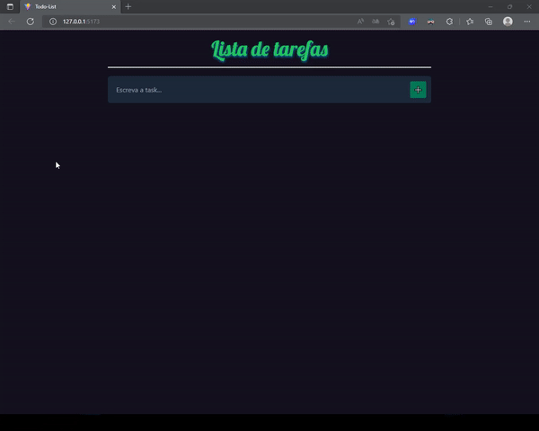

<h1 align="center">Todo-List</h1>

## 📷 Demonstração


<h1 align="center">
    
</h1>


## 📝 Sobre o prejeto

Esse projeto é uma aplicação que exibe os dados descritos pelo usuário mostrando tarefas que ira fazer.

## 👷 Rodando o projeto


``` bash
# Clone este repositório
$ git clone https://github.com/wellington-dev/Todo-list

#Acesse a pasta do projeto no terminal/cmd
$ cd Todo-list

# Instale as dependências
$ npm install

# Para iniciar a aplicação
$ npm run dev
```

## 🚀 Tecnologias


- [TypeScript](https://typescriptlang.org/)
- [Tailwind](https://tailwindcss.com/)
- [Vite](https://github.com/axios/axios)
- [Eslint](https://eslint.org/)
- [Prettier](https://prettier.io/)
- [EditorCofig](https://editorconfig.org/)